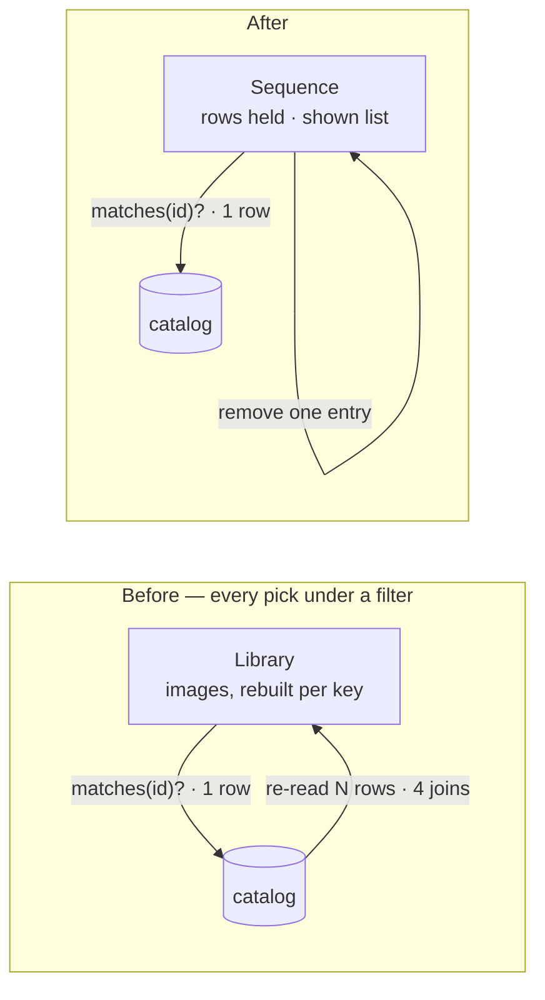

# Collections

**Status:** accepted · **Decided:** 2026-09-19 · **Schema:** migration `006` ·
**Code:** `rawkit-catalog::collections`, `rawkit-shell::sequence` ·
**Commits:** `c9eef29` `8fa6664` `cd89a1a` `a52cef3`

A collection copies nothing. It is a list of pointers into the library, in an
order somebody chose — and most of what follows is about making it cost what a
list of pointers should cost, at twenty thousand photographs and a hundred
collections.

## What it had to satisfy

A filter answers *which frames satisfy this rule*: it is re-evaluated, always in
the library's order, and nothing in it can put one frame before another. A
collection answers the other question — *these ones, in this sequence, because I
said so*. The hand-made order is the whole reason it is a table and not a saved
filter.

- SQLite, one writer, no server.
- A keypress has **100 ms** for the query, the render request and the redraw.
- Opening a catalog runs a full `integrity_check`, which reads every page — so
  **every b-tree added is paid for at every launch**.
- No speculative columns. An index is justified by a query something runs.
- A public beta follows this phase. After it, the schema migrates on other
  people's libraries, and migration `006` can no longer be edited in place.

## The decisions

| | Decision | In one line |
|---|---|---|
| **D1** | Static only | No `kind`, no `rules_json`. A smart collection is a saved filter, and the filter language to save is the search work's to design. |
| **D2** | A row per membership, sorted by the photograph | `PRIMARY KEY (image_id, collection_id)`, `WITHOUT ROWID`, plus one index on `(collection_id, position)`. Two b-trees. |
| **D3** | Order is an opaque integer | `position` is not unique, not contiguous, never exported. Moving one frame writes two rows. |
| **D4** | Constraints added while nothing can break them | Folded names, the quick collection pinned to the root, exempt from the name rule, and created by the migration. |
| **D5** | Counts on demand, held by the shell | Asked for at open and when a membership changes — not per keypress. |
| **D6** | Nesting is a parent pointer | `parent_id`. One kind of container. |
| **D7** | What is on screen is one value | `Sequence { source, filter, rows, shown }`, with one constructor. |
| **D8** | K has a target, and the catalog remembers it | `is_target`, one row at most, seeded on the quick collection. |
| **D9** | Everything done to a collection is undone by Z | The catalog answers a removal with what it removed; the shell keeps that and hands it back. |

Deferred, deliberately: **gapped keys and moving a block of frames**, until there
is a drag to need them.

## D2 — why the table is sorted by the photograph

A membership is three integers, and it points at `images` rather than `files`
because of virtual copies: two interpretations of one frame are two rows, and
either can be in a collection without the other.

The first shape stored each membership in **four** b-trees, one of which nothing
queried. It was invisible until the scale fixture was rebuilt as a heavy user;
then opening a catalog went from 27 ms to 130 ms without anyone touching `open`.

| Option | Open | Delete 200 photographs | |
|---|--:|--:|---|
| Four b-trees | 130 ms | — | Over budget. One tree was dead weight. |
| Key led by the collection | 63 ms | **1.1 s** | The delete cascade scans the table *per image*. |
| …plus `INDEX (image_id)` | +21 ms | 6 ms | A third tree, paid for at every launch. |
| **Key led by the image** | **72 ms** | **5.1 ms** | No third tree, and reads got faster. |
| One packed blob per collection | ~⅓ the size | n/a | No foreign key — and `images.id` can be reused, so a stale entry would put a *new* photograph in an *old* collection. |

The question was never whether to index `image_id`. It was which of the two
columns the table should be sorted by: the order index already served everything
that starts from a collection, and in a `WITHOUT ROWID` table it carries the key,
so reading a collection never touches the table at all.

## D3 — the contract on `position`

Reads order by `(position, image_id)`, so equal values still have one answer, and
nothing depends on what the numbers *are*. That is the decision: it keeps the
numbering scheme free to change. Dense today; spreading the values out to make
room for a block move is one `UPDATE` on any catalog there will ever be.

| Scheme | Move a block of N | How it fails | |
|---|---|---|---|
| **Dense integers + `swap`** | 25–35 ms to the front of 20 000 | never | Now. Fine to ~5 000 hand-ordered members. |
| Gapped integers | 1.6 ms per 1 000, any size | detectably; renumber 49 ms | When drag exists. |
| `REAL` midpoints | same | **silently** — a midpoint equals its neighbour | Rejected. |
| String keys | same | never; keys grow | Rejected: solves concurrent writers, and there are none. |
| Linked list | constant | a cascade delete breaks the chain | Rejected. |

## D4 — constraints that could only be added now

A rule can be loosened on any catalog there will ever be. It can only be
*tightened* on one that does not already break it.

- **`name_key`** — the name, composed and lower-cased, stored the way `path_key`
  is. "Portfolio" and "portfolio" are one name. Not `NOCASE`, which folds ASCII
  alone.
- **`CHECK (is_quick = 0 OR parent_id IS NULL)`** — `remove()` guards only the id
  it is handed; nested, the quick collection would go with its parent and the
  shell could not open the catalog.
- **The quick collection is exempt from the root-name rule.** Its identity is a
  flag and its name is an English literal, so an imported library with a
  collection called the same thing does not fail on a row nobody made.
- **The migration creates it**, so "there is exactly one" needs no code to be
  true.

## D7 — one value, one way in

The shell kept four loose fields — the photographs, the filter, which collection,
the cursor — and re-read the first from the catalog in six places. Each had to
remember on its own which collection it was in. Five did; the sixth, in the undo
arm, dropped you into the whole library without saying so. **That is a bug a
structure permits and only discipline prevents.**

Nothing about the *source* changes when a frame is judged; one frame's admission
does. So the rows are held in source order and the filter is a list of which to
show. **SQL stays the only opinion about what a filter means** — `cull::matches`
and `cull::admitted` are both built on the `narrowing()` the full read uses.

The assumption underneath: judging a photograph changes only *that* photograph's
admission. True of flag, rating and colour; a filter about a frame's neighbours
("top of each stack") would break it. `Sequence::agrees_with` is the full re-read
kept as a test oracle, and it runs after every action in every shell test.

## D8 — where K goes

K put a frame in the quick collection and nowhere else, so building a portfolio
meant marking, naming and creating — every time. Now K goes to a **target**,
which is the quick collection until somebody aims it elsewhere.

| Where the target lives | |
|---|---|
| In the shell, per session | Reopen the catalog mid-project and K has quietly gone back to the quick collection. |
| A settings file | A second place for the truth about a catalog, which travels without it. |
| **A flag on the row** | Survives a restart, travels with the file, and a unique partial index makes "at most one" the schema's job. |

`set_target` clears and sets inside one transaction, so a bad id leaves the old
target standing. Deleting the target hands the key back to the quick collection
in the same transaction as the delete — there is never a moment with nowhere
for K to go.

## D9 — undo, including for a deleted collection

A delete cascades, so by the time anyone asks for it back the memberships are
gone. The catalog therefore *answers* a removal with what it removed:
`remove → Removed` (the whole subtree, each collection's members and their
positions), `take_out` and `clear → Vec<Placed>`. The shell puts that on the
same undo stack as a flag or a rating, and `restore` / `put_back` take it back.

- **Restore uses fresh ids.** SQLite reuses rowids, so the old id may belong to
  something else by now. Parents are remapped as the subtree is rebuilt, and the
  shell drops any undo record that names a deleted id.
- **A photograph deleted in between stays deleted.** `put_back` inserts only
  where the image still exists; an undo does not conjure a row.
- **A name taken in between is refused**, not silently suffixed.
- The record lives in memory. Quit, and the delete is final — the same promise
  every other undo in the shell makes.

The page followed: a chip per collection stopped reading at about eight, so
collections are a list in the panel — name, count, ★ for the target, rename,
delete — and the filter line keeps **one** chip, for the view you are in.

## What it bought

Twenty thousand photographs, a hundred collections, about six memberships each.

| | Before | After | |
|---|--:|--:|---|
| Arrow key | 1.6 ms | **7.7 µs** | flat |
| Pick under a filter | 19.9 ms | **74 µs** | flat |
| Undo under a filter | 19.4 ms | **65 µs** | flat |
| Set a filter | 19.8 ms | **1.4 ms** | linear; a deliberate act |
| Move one frame | 70.7 ms | **80 µs** | flat |
| Delete 200 photographs | 1.1 s | **5.1 ms** | |
| Undo deleting a 20 000-member collection | 109 ms | **51 ms** | linear; the worst case a library has |
| Undo emptying one | 101 ms | **43 ms** | linear |
| Rewrite a 20 000-member order | 88 ms | **60 ms** | not on a keypress |

The last three were one mistake: `Connection::execute` compiles its SQL on every
call, and a loop over members paid for twenty thousand parses. Every loop sized
by the caller now prepares once. The gate found it the first time it measured an
undo — 109 ms is past the budget.
| Open the catalog | 130 ms | **72 ms** | 27 ms with no collections |

One machine; the shapes matter more than the absolutes. Both gates are in the
tree: `rawkit-catalog/tests/scale.rs` and
`a_cull_stays_instant_at_the_size_of_a_real_library` in the shell. Run them with
`-- --ignored --nocapture`.

## Accepted, deferred, open

**Accepted costs.** Opening is 45 ms slower on a heavily used library, and linear
in its size. Setting a filter is one scan: about 7 ms at 100 000. The held rows
carry path strings — roughly 90 MB at 500 000 photographs.

**Deferred.** Gapped keys and a `move_to` primitive. A note for whoever builds
it: under a filter, `swap` makes the *untouched* frame jump the hidden ones;
"move A to just after B" writes only A, and should make the one-step move its
N = 1 case. Also smart collections, and "which collections hold this frame" —
which the key already answers.

**Open.**
- The full integrity check belongs off the path the window waits on.
- The collection list is serialised to the page on every key.
- A second writer — the CLI scanning while the shell is open — leaves the held
  rows stale. `PRAGMA data_version` per key is microseconds.
- The collections list is flat-with-indent and always fully drawn. Past a few
  hundred it wants collapsing and a filter box.
- "New from selection" closes its form even when the name is refused.

## If you change this

| Changing… | …is guarded by |
|---|---|
| the tables or their indexes | `a_fresh_catalog_arrives_at_the_current_version`, and both scale gates |
| what `position` promises | `a_collection_keeps_the_order_it_was_given`, `swapping_two_frames_moves_only_those_two` |
| the naming or quick-collection rules | `a_name_is_compared_the_way_a_person_reads_it`, `the_quick_collection_cannot_be_put_inside_another` |
| the target | `the_key_has_exactly_one_place_to_put_a_photograph`, `deleting_the_target_hands_the_key_back_to_the_quick_collection`, `the_key_goes_wherever_it_has_been_aimed` |
| what a removal answers with, or how it is put back | `a_deleted_collection_comes_back_whole`, `an_undo_does_not_conjure_a_photograph_that_has_gone`, `what_is_taken_out_goes_back_where_it_was`, and the undo rows of the scale gate |
| anything the shell holds about collections | the oracle compares the held list and target with the catalog after every action |
| anything that re-reads what is on screen | `judging_inside_a_collection_stays_inside_it`, and the oracle on every action |
| a filter whose answer depends on other frames | the oracle will fail — that is its job. Re-read in full for that filter. |
